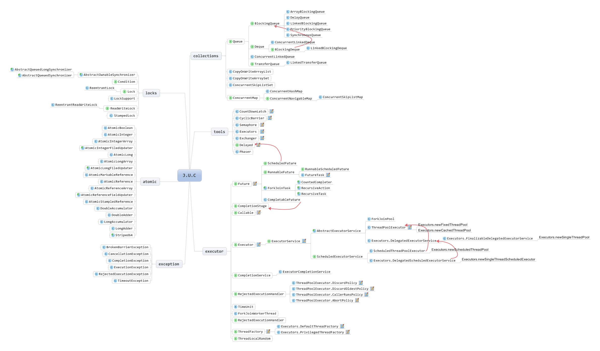

并发不一定要依赖多线程，但Java里面讨论并发，大多数离不开线程。主流操作系统都提供了线程实现，实现线程主要有3种方式：

	1. 使用内核线程实现。内核线程是直接由操作系统内核支持的线程，由内核来完成线程切换，内核通过操纵调度器对线程进行调度。程序一般不会直接使用内核线程，而是使用内核线程的轻量级进程接口，轻量级进程与内核线程具有一对一的关系。缺点在于，各种进程操作都需要进行系统调用，代价高，需要在用户态和内核态中来回切换。同时，轻量级进程都需要一个内核线程支持，消耗内核资源。
	2. 使用用户线程实现。狭义的用户线程指完全建立在用户空间的线程库上，系统内核无法感知用户线程的存在。所有线程操作都需要用户程序自己处理。
	3. 混合实现。

对于Sun JDK来说，Windows版和Linux版都是使用内核线程模型来实现，一个线程对应一个轻量级进程。Java提供了在不同硬件和操作系统平台对线程操作的统一处理，每个java.lang.Thread类的实例就代表一个线程。Thread的关键方法都被声明为Native。

# 1. 如何调度线程？

线程调度指提供为线程分配处理器使用权的过程，主要有两种：

	1. 协同式线程调度。线程执行时间由线程本身来控制，线程把自己工作执行完后，主动通知系统切换到另一个线程。好处是实现简单，自己干完事情才会进行线程切换，切换操作对线程自己可知，没有线程安全问。坏处是线程执行时间不可控制，如果某个线程编写有问题，无法告知系统进行线程切换，程序一直卡在那里。
	2. 抢占式线程调度，每个系统由系统来分配执行时间，线程切换不由线程本身觉得。好处是线程执行时间是系统可控的，不会出现某个线程导致整个进程阻塞的问题。

Java使用的线程调度方式是抢占式调度。虽然Java线程调度是系统自动完成的，但我们可以通过设置线程优先级，让系统给某些线程多分配一点执行时间，另外一些线程少分配一点。Java一共设置了10个级别的**线程优先级**，从 Thread.MIN_PRIORITY 到 Thread.MAX_PRIORITY ，两个线程同时处于Ready状态，优先级越高的线程越容易被系统选择执行。

# 2. 线程有哪些状态？

Java定义了5中线程状态，任意一个时间点，一个线程只能有且只有其中一种状态：

	1. 新建。new Thread()，但没有start
	2. 运行。Thread执行start之后，包含了OS线程状态中的Running和Ready两个状态。
	3. 等待。不会被分配CPU执行时间，一段时间后被唤醒。被其他线程显示唤醒的等待叫无限期等待，由系统自动唤醒的叫限期等待。
	4. 阻塞。排他锁被另一个线程占有时，当前线程等待获取这个排它锁。
	5. 结束。已经终止的线程。

# 3. Java提供的并发工具

Java并发工具包提供了支持并发的工具：

# 4. 并行程序设计模式

**Future模式**是一种异步调用方式，程序提交一个请求，不等结果返回，就继续处理其他事务，结果返回再处理这个结果。JDK中通过java.util.concurrent.Future实现。

# 5. 线程安全

在 java 中，所有局部变量（Local variables），方法定义参数（java 语言规范称之为 formal method parameters）和异常处理器参数（exception handler parameters）不会在线程之间共享，对其它线程是不可见的，它们不会有内存可见性问题，也不受内存模型的影响。但所有实例域、静态域和数组元素存储在堆内存中，堆内存在线程之间共享可见的，对于堆中的数据，在工作内存中会对应的创建该数据的副本(相当于缓冲)，这些副本对于其它线程也是不可见的。普通变量不能做到可见性，变量值在线程间传递都需要经过主存来完成。

当多个线程同时操作主存中的一个变量时，就可能出现线程安全问题。Java里的**线程安全**是限定于多个线程存在共享数据的前提，有以下几种方法实现共享数据的线程安全：

	1. 使用不可变的对象。
	2. 使用线程安全的容器。
	3. 使用Collections.synchronizedCollection()方法将非线程安全器变成线程安全容器。
	4. 使用同步手段操作共享对象。

**同步**是指在多个线程并发访问共享数据时，保证共享数据在同一时刻只被一个线程使用。**互斥**是实现同步的一种手段，临界区、互斥量、信号量和事件都是主要的互斥实现方式。

	1. 临界区：在任意时刻只允许一个线程对共享资源进行访问。如果有多个线程试图同时访问临界区，那么 在有一个线程进入后其他所有试图访问此临界区的线程将被挂起，并一直持续到进入临界区的线程离开。临界区在被释放后，其他线程可以继续抢占，并以此达到用原子方式操作共享资源的目的。 
	2. 互斥量：只有拥有互斥对象的线程才具有访问资源的权限，当前占据资源的线程在任务处理完后应将拥有的互斥对象交出，以便其他线程在获得后得以访问资源。互斥量比临界区复杂。因为使用互斥不仅仅能够在同一应用程序不同线程中实现资源的安全共享，而且可以在不同应用程序的线程之间实现对资源的安全共享。 
	3. 信号量：在同一时刻，允许多个线程访问同一资源，但是需要限制访问此资源的最大线程数目。
	4. 事  件：通过通知操作的方式来保持线程的同步。并且可以实现不同进程中的线程同步操作。 

**volatile**关键字是JVM提供的最轻量级的同步机制，保证此变量对所有线程的可见性，**可见性**指当一个线程修改了这个变量的值，其他线程可以立即得知这个新值。普通变量不能做到这点，变量值在线程间传递都需要经过主存来完成。线程工作内存中volatile变量可能不一致，但由于每次使用之前都要先刷新，执行引擎看不到不一致的情况，因此可以认为不存在一致性问题。但需要特别注意一点，**Java里面运算并非原子操作，导致volatie变量运算在并发下一样是不安全的**。所以只在符合以下两条规则的运算场景下，我们才使用volatile变量：

	1. 运算结果不依赖变量的当前值，或者能够保证只有单一的线程修改变量的值。
	2. 变量不需要与其他的状态变量共同参数不变约束。

如果不满足上面2个条件，我们要使用加锁（synchronized或java.util.concurrent中的原子类）来保证原子性。

**synchronized**关键字是最基本的互斥同步手段，经过编译后，会在同步块前后形成monitorenter和monitorexit这两个字节码指令，这两个指令都需要一个reference类型的参数来指明要锁定和解锁的对象。这是一种原生语法层面的互斥锁，锁操作被透明化。

	1. 执行monitorenter时，首先去尝试获取对象锁，如果该对象没有被锁定，或者当前线程已经拥有该对象的锁；把锁的计数器加1；
	2. 执行monitorexit时，将锁的计数器减1，当计数器为0时，释放锁。

synchronized同步块对同一个线程来说是**可重入**的，同一个线程可以多次获取该对象锁，不至于把自己锁死，但会阻塞后面其他线程的进入。由于Java线程时映射到操作系统原生线程之上的，要阻塞或唤醒一个线程，都需要操作系统的帮助，这就需要从用户态转换到核心态，需要耗费很多的处理器时间，因此synchronized是一个重量级的操作，只有在确实必要的情况下才使用。JVM本身也会进行一下优化，在通知操作系统阻塞线程之前加入一段自旋等待过程，避免切入核心态。

通常，共享数据的锁定状态只会持续很短一段时间，为这段时间去挂起和恢复线程并不值得。如果物理机上有一个以上处理器，可以让两个或以上的线程同时并行执行，我们就可以让后面请求锁的线程”稍等一会儿“，但不放弃处理器执行时间，看看持有锁的线程是否很快就会释放锁。为了让线程等待，只需要让线程执行一个忙循环（自旋），这就是**自旋锁**。自旋等待不能替代阻塞，且不说对处理器数量的要求，自旋等待虽然可以避免线程切换开销，但它却要占用处理器时间，如果锁占用时间短，自旋效果好，反正，自旋只会消耗处理器资源，而不会做任何有用的工作。因此，JDK中自旋等待的时间会有一定的限度，自旋超过限定次数（默认10次）仍然没有成功获得锁，就会使用传统方式挂起线程。

**ReentrantLock**也可以用来实现同步，同样具备可重入特性，但使用时需要配合API层面的互斥锁，lock()和unlock()方法配合try/finally语句块完成。ReentrantLock比synchronized更高级的是：

* **等待可中断**。当持有锁的线程长期不释放锁的时候，正在等待的线程可以选择放弃等待，改为处理其他事情，在处理实际非常长的同步块中很有帮助。

* 可实现公平锁。**公平锁**是多个线程在等待同一个锁时，必须按照申请锁的时间顺序来依次获得锁；**非公平锁**不保证这一点，在锁释放时，任何一个等待锁的线程都有机会获得锁。synchronized中的锁是非公平的，ReentrantLock默认也是非公平的，但可以通过在构造时传布尔值，要求使用公平锁。

* **锁可以绑定多个条件**。利用Condition的await()和signal()，可以实现一个隐含的条件。如果要和多个条件关联，ReentrantLock可以多次调用newCondition()方法，实现一个ReentrantLock对象绑定多个Condition对象。但在synchronized同步块中，锁对象的wait()和notify()方法可以实现一个隐含的条件，如果要和多个条件关联时，就不得不额外添加一个锁。

JDK6之后，加入了针对锁的优化措施，synchronized和ReentrantLock的性能基本上完全持平，性能不再是选择ReentrantLock的因素。

互斥同步又叫**阻塞同步**，认为不做并发措施就肯定会出问题，但进行线程阻塞和唤醒又带来性能问题，这是一种悲观并发策略。其实还有一种基于冲突检测的乐观并发策略，先进行操作，如果没有其他线程争用共享数据，那操作就成功了；如果存在共享数据争用，产生冲突，再进行其他补偿措施（最常见的就是不断重试，直到成功），不需要线程挂起，称为**非阻塞同步**。

非阻塞同步是在硬件指令集发展的基础上才能进行，因为我们需要操作和冲突检测这两个步骤具备原子性，如果仍使用互斥同步来保证就没有意义了，只能依靠硬件来完成这件事情，硬件保证一个从语义上看起来需要多次操作的行为只通过一条处理器指令就能完成，这类指令常用的有：

	1. 测试并设置（Test-and-Set）
	2. 获取并增加（Fetch-and-Increment）
	3. 交换（Swap）
	4. 比较并交换（Compare-and-Swap）
	5. 加载链接/条件存储（Load-Linked/Store-Conditional）

前面3个指令上世纪已经存在于多数指令集，后面2个指令是现代处理器新增的，这两个指令功能目的类似。**CAS指令**需要三个操作数，分别是 内存位置V 、 旧期望值A 和 新值B ，处理过程是一个原子操作：

	当且仅当 V 符合旧期望值 A 时，处理器用新值 B 更新 V 的值，否则就不执行更新，但不管是否更新了 V 的值，都会返回 V 的值。

JDK5之后，Java程序才能使用CAS操作，由sun.misc.Unsafe类里面的compareAndSwapInt()和compareAndSwapLong()等几个方法包装提供。但Unsafe类限制只能由启动类加载器加载的Class访问，如果不采用反射手段，我们只能通过其他的Java API间接使用它。

如果不涉及共享数据，那么就也是线程安全的，方法有：

	1. 使用可重入代码。如果一个方法，它的返回结果是可预测的，只要输入了相同的数据，就都能返回相同的结果，这个方法就是可重入的。
	2. 使用线程本地存储

Java中使用**ThreadLocal**来实现线程本地存储功能。

